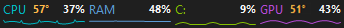

# Taskbar Monitor

> **베타 테스트 버전입니다.** 개발 중인 프로그램으로 예상하지 못한 버그, 표시 오류, 호환성 문제가 발생할 수 있습니다. 문제가 생기면 사용 환경과 재현 방법을 [GitHub Issues](https://github.com/svsivsv/TaskbarMonitor/issues)에 남겨 주세요. 스크린샷이나 로그를 첨부할 때는 개인정보를 가려 주세요.

Windows 11 x64 작업 표시줄에 온도 참고값, CPU, 메모리, 디스크, 네트워크, GPU 사용량과 미니 그래프를 표시하는 네이티브 위젯입니다. 현재 베타 단계이며 인텔·AMD 64비트 PC의 기본 가로형 작업표시줄을 기준으로 검증합니다.

처음에는 기본 설정을 유지한 채 `저장하고 위젯 켜기`를 누르세요. 위젯이 안 보이면 설정창 하단의 상태 안내를 확인하세요. 작업표시줄 공간이 부족하면 표시 위치를 위쪽 또는 팝업으로 바꿀 수 있습니다. `저장·적용`도 설정을 저장하지만, 숨겨 둔 위젯을 강제로 켜지는 않습니다.

**[TaskbarMonitor.exe 다운로드](https://github.com/svsivsv/TaskbarMonitor/raw/refs/heads/main/release/TaskbarMonitor.exe)** · [실행 파일 위치](release/TaskbarMonitor.exe)

위 링크는 이 저장소의 `release/TaskbarMonitor.exe`를 내려받습니다. 로컬 프로젝트와 GitHub에 같은 코드·설명·EXE 구성을 유지합니다. [배포 페이지](https://github.com/svsivsv/TaskbarMonitor/releases/tag/current)도 하나만 운영하며 같은 EXE를 제공합니다. 배포 이름과 태그에는 버전 숫자를 붙이지 않습니다. 파일을 구별해야 할 때는 PowerShell의 `Get-FileHash .\TaskbarMonitor.exe -Algorithm SHA256`으로 확인한 파일 지문을 사용하세요. Windows가 표시하는 기본 파일 버전은 배포 식별자로 사용하지 않습니다.

## 화면

### 위젯 단독 모습



### Windows 11 작업 표시줄 안쪽 배치


위젯은 Windows 날씨 버튼과 시작 버튼의 실제 위치를 읽어 두 버튼 사이의 빈 공간에 맞춰집니다. 위치 조회는 별도 작업에서 수행합니다. 공간이 48px보다 좁거나 시작 버튼 위치를 확인하지 못하면 다른 버튼을 가리지 않도록 위젯을 숨기고 트레이 툴팁으로 안내합니다. 트레이 우클릭으로 위쪽·팝업 모드를 선택할 수 있으며, 빈 공간이 다시 확보되면 안쪽 표시를 복원합니다. `작업표시줄 배경 투명`을 사용하면 별도 패널처럼 보이지 않고 글자와 그래프만 표시됩니다.

Windows 11의 XAML 작업표시줄은 일반 Win32 자식 창을 덮기 때문에, 안쪽 모드는 작업표시줄 소유 오버레이를 빈 공간에 정렬하는 호환 방식을 사용합니다. 좌표와 크기는 작업표시줄의 빈 영역 안으로 제한하고, 검색·시작 메뉴가 열리면 Windows 기본 UI를 가리지 않도록 잠시 숨깁니다. 독립 팝업 모드와는 별개입니다.

## 주요 기능

시작 직후에는 작업표시줄 배치가 0.5초 동안 일치하는지 확인한 뒤 표시합니다. 시작 후 5초 및 설정창 열기·닫기 직후에는 위치를 빠르게 재확인하고 이후에는 약 2초 간격으로 조회합니다. 조회로 빈 공간 감소를 확인하면 반영하고, 늘어난 공간은 안정된 뒤 반영합니다. Windows 응답 지연에 따라 위치 반영이 늦어질 수 있습니다.

- CPU, 메모리, 디스크, 네트워크, GPU를 개별적으로 표시하거나 숨길 수 있습니다.
- CPU와 GPU 온도를 항목 이름과 사용률 사이에 표시하며, 두 온도를 각각 켜거나 끌 수 있습니다.
- 작업표시줄 안쪽에서는 모든 항목 칸을 같은 너비로 유지합니다. `공간에 자동 맞춤`을 켜면 항목을 꺼도 날씨와 시작 버튼 사이에서 확보한 전체 폭은 줄이지 않고, 남은 항목이 그 공간을 나눠 사용합니다. 온도 글자는 가로로 압축하지 않으며 공간에 따라 `58°C` 또는 `58°`로 표시하고, 두 형식 모두 들어가지 않는 극단적으로 좁은 칸에서는 왜곡하는 대신 온도만 생략합니다.
- 메모리 값을 `%`, `사용 GB`, `사용/전체 GB` 중에서 선택할 수 있습니다.
- C:, E: 같은 여러 드라이브를 선택해 각각의 디스크 사용률과 그래프를 표시합니다.
- 선택한 드라이브의 값을 읽지 못하면 다른 드라이브의 값으로 대체하지 않고 `—`로 표시합니다. 측정이 없는 구간은 그래프를 연결하지 않습니다.
- 글자 높이는 실제 글꼴과 화면 배율에 맞춰 계산합니다. 글자가 위젯 높이보다 크면 가로로 찌그러뜨리지 않고 글꼴 크기를 비례 축소합니다. 글자를 표시한 뒤 그래프 공간이 부족하면 그래프를 생략하므로, 더 큰 글자가 필요하면 내부 높이 또는 팝업 높이도 늘리세요.
- 각 항목의 숫자와 그래프를 서로 독립적으로 켜고 끌 수 있습니다.
- 표시 이름, 표시 순서, 색상, 그래프 형태를 항목별로 변경할 수 있습니다.
- 긴 표시 이름은 자기 항목의 이름 칸에서만 잘리며 온도·사용률이나 옆 항목을 덮지 않습니다. 온도와 사용률 사이에는 고정 간격을 확보합니다.
- 선, 채움, 막대 그래프를 지원합니다.
- 0.2~10초 갱신 간격과 10~600초 그래프 기록 시간을 선택할 수 있습니다.
- 그래프의 가로축은 실제 측정 시각을 기준으로 합니다. 절전 측정이나 중단·복귀 시에도 기록 시간보다 오래된 값은 제외하고, 긴 측정 중단 구간은 선으로 이어 붙이지 않습니다.
- 작업 표시줄 안쪽, 작업 표시줄 위쪽, 트레이 클릭 팝업 창 모드를 지원합니다.
- 필요할 때 `공간 초과 시 좌우 페이지`를 켜면 좁은 공간에서 좌우 페이지 버튼으로 항목을 순환합니다.
- 마지막 페이지는 앞 항목 일부를 함께 보여줘 한 항목만 덩그러니 남는 상황을 줄입니다. 공간상 한 항목만 들어가는 경우에는 한 개씩 표시됩니다.
- 팝업 창의 너비·높이를 숫자로 지정하거나 오른쪽 아래 모서리를 끌어 직접 조절할 수 있습니다. 기본 크기는 500×72px입니다.
- 떠있는 창은 기본적으로 일반 창 순서를 사용하며 `항상 위`, `항상 뒤`를 사용자가 명시적으로 선택할 수 있습니다.
- `앱 시작 시 팝업 표시`를 켜거나 끌 수 있으며 기본값은 표시입니다. 검색·시작 메뉴 때문에 자동으로 숨었다 다시 나타나지는 않습니다.
- 위젯 전체 영역 클릭 인식과 완전 클릭 통과를 선택할 수 있습니다.
- 전체화면에서 숨기기, 항상 표시, 표시하되 클릭 통과 중 하나를 선택할 수 있습니다.
- 위젯이 숨겨졌을 때 측정을 완전히 멈추는 것이 기본이며, 필요하면 5초 간격 또는 계속 측정으로 바꿀 수 있습니다.
- Windows 로그인 시 저장된 설정으로 자동 실행할 수 있습니다.
- 캡처 도구, 바탕화면, 일반 최대화 창을 전체화면 앱으로 잘못 판단하지 않도록 처리합니다.
- 검색·시작 메뉴가 열리면 Windows 기본 UI가 위젯보다 우선 표시됩니다.
- 설정창·메뉴 조작 중에도 숫자와 그래프는 갱신하며, 측정 갱신 때문에 창의 앞뒤 순서나 표시 모드를 다시 적용하지 않습니다. 검색·시작 메뉴 및 사용자가 선택한 전체화면 숨김 설정은 설정창이 열려 있어도 우선합니다.
- 별도의 상세 그래프 창은 띄우지 않습니다. 그래프는 위젯과 설정창 미리보기 안에서 확인합니다.

## 마우스 조작

| 조작 | 동작 |
| --- | --- |
| 한 번 클릭 | 별도 창을 열지 않습니다. 팝업 모드에서는 누른 채 끌어 위치를 옮길 수 있습니다. |
| 더블클릭 | Windows 작업 관리자 열기 |
| 우클릭 | `위젯 설정 수정`, 세 가지 표시 모드, 표시/숨김, 클릭 인식, 창 순서, 일시정지, 작업 관리자, 종료 메뉴 |
| 우클릭 메뉴 바깥 클릭 또는 재우클릭 | Windows 표준 메뉴처럼 닫기 |
| 트레이 아이콘 왼쪽 클릭 | 현재 위젯 표시/숨기기. 팝업 모드에서도 동일하게 열기/닫기 |
| 트레이 아이콘 우클릭 | 위젯과 동일한 관리 메뉴 |
| 팝업 본문 드래그 | 고정 전 팝업 창 위치 이동 |
| 팝업 오른쪽 아래 모서리 드래그 | 팝업 크기 직접 조절 및 즉시 저장 |
| 설정의 `현재 팝업 위치 고정` | 현재 화면 좌표 저장 및 이동 잠금, 옵션을 끄면 다시 이동 가능 |
| `떠있는 창 앞뒤 순서` | 일반 창 순서, 항상 위, 항상 뒤 중 선택 |

## 설정 화면 설명

EXE를 직접 실행하거나 위젯을 우클릭한 뒤 `위젯 설정 수정`을 선택하면 설정창을 열 수 있습니다. 설정 항목 위에 마우스를 올리면 프로그램 안에서도 상세 설명이 표시됩니다.

### 표시 항목 표

| 설정 | 설명 |
| --- | --- |
| 표시 | 해당 측정 항목 전체를 위젯에 표시하거나 숨깁니다. |
| 항목 | CPU, 메모리, 디스크, 네트워크, GPU 중 측정 대상을 나타냅니다. |
| 표시 이름 | 위젯에 나타날 짧은 이름입니다. 셀을 클릭해 직접 수정할 수 있습니다. |
| 온도 | CPU/GPU 온도를 이름과 사용률 사이에 표시합니다. 두 항목을 따로 켜고 끌 수 있으며 센서를 읽지 못하면 온도만 자동으로 생략합니다. |
| 온도 색 | CPU와 GPU의 온도 글자 색을 각각 선택합니다. 기본값은 주황색입니다. |
| 숫자 | 현재 사용률 또는 네트워크 전송 속도를 숫자로 표시합니다. |
| 값 형식 | 메모리는 `%`, `사용 GB`, `사용/전체 GB`를 선택합니다. 다른 항목은 기본 형식을 사용합니다. |
| 그래프 | 설정한 기록 시간 동안의 변화 추이를 미니 그래프로 표시합니다. |
| 그래프 형태 | `선`은 가장 단순하고 가벼우며, `채움`은 변화량이 잘 보이고, `막대`는 순간값 비교에 적합합니다. |
| 색상 | 항목 이름과 그래프에 사용할 색상을 선택합니다. |

`전체 표시`, `모두 해제`, `그래프 전체`, `그래프 해제` 버튼으로 여러 항목을 한 번에 변경할 수 있습니다. `위로`, `아래로` 버튼은 작업 표시줄에 보이는 항목 순서를 변경합니다.

### 크기·동작·성능

| 설정 | 범위 / 권장값 | 설명 |
| --- | --- | --- |
| 갱신 간격 | 200~10000ms / **1000ms 권장** | 시스템 값을 다시 읽는 주기입니다. 낮을수록 빠르게 반응하지만 CPU 사용량이 늘 수 있습니다. |
| 그래프 기록 | 10~600초 / **60초 권장** | 미니 그래프가 보관할 과거 시간입니다. 길수록 변화 추이를 오래 볼 수 있고 메모리를 조금 더 사용합니다. |
| 최대 너비 | 160~1200px / 기본 560px | 위젯이 차지할 수 있는 최대 가로 폭입니다. 항목이 잘리면 늘리고 작업표시줄 공간이 부족하면 줄입니다. |
| 왼쪽 여백 | 0~1200px / 기본 126px | 작업 표시줄 왼쪽 끝을 기준으로 한 시작 위치 보정값입니다. 날씨·시작 버튼 사이 배치를 미세 조정할 때 사용합니다. |
| 투명도 | 25~100% / 기본 94% | 작업 표시줄 위쪽·팝업 모드의 패널 투명도를 조절합니다. `작업표시줄 배경 투명`을 켠 안쪽 모드에서는 적용되지 않습니다. |
| 글꼴 크기 | 7~18 / 기본 9 | 항목 이름과 숫자의 글자 크기입니다. 칸이 좁을 때는 8~9가 보기 좋습니다. |
| 표시 위치 | 안쪽 / 위쪽 / 팝업 | `팝업`은 작업 표시줄 위 독립 창을 트레이 아이콘 클릭으로 열고 닫습니다. |
| 전체화면 동작 | 숨기기 / 항상 표시 / 클릭 통과 | 클릭 통과는 위젯을 보이게 유지하지만 마우스 입력을 전체화면 앱으로 전달합니다. |
| 내부 항목 폭 | 48~180px / 기본 70px | 안쪽 모드에서 CPU·RAM 같은 항목 하나가 차지할 기준 폭입니다. 좁으면 항목 이름이 축약될 수 있습니다. |
| 내부 높이 | 20~48px / 기본 28px | 작업 표시줄 안쪽 위젯의 높이입니다. 작업 표시줄 높이를 넘지 않도록 자동 제한됩니다. |
| 팝업 너비 | 200~1200px / 기본 500px | 독립 팝업 창의 가로 크기입니다. 항목 수와 원하는 그래프 폭에 맞춰 조절합니다. |
| 팝업 높이 | 48~400px / 기본 72px | 독립 팝업 창의 세로 크기입니다. 값을 높이면 미니 그래프도 함께 커집니다. |
| 떠있는 창 순서 | 일반 / 항상 위 / 항상 뒤 | 기본은 일반 창 순서입니다. `항상 위`는 사용자가 직접 선택한 경우에만 최상단을 사용하며, `항상 뒤`는 다른 일반 창 뒤로 보냅니다. |

팝업 모드에서는 위젯 본문을 끌어 원하는 모니터와 위치로 옮길 수 있습니다. 오른쪽 아래 대각선 손잡이에 마우스를 올리면 크기 조절 커서가 나타나며, 손잡이 주변의 넓은 44px 영역을 끌어 너비와 높이를 바로 바꿀 수 있습니다. 놓는 순간 크기가 저장됩니다. 원하는 위치와 크기를 맞춘 뒤 설정의 `현재 팝업 위치 고정`을 켜고 적용하면 좌표가 저장되고 이동·크기 조절이 잠깁니다. 앱을 다시 실행해도 고정 위치가 복원되며, 옵션을 끄면 다시 조절할 수 있습니다. `위젯 전체 영역 클릭 인식`을 꺼 둔 동안에는 모든 마우스 입력이 뒤 창으로 통과하므로 이동하거나 크기를 바꾸려면 이 옵션을 먼저 켜야 합니다.

팝업과 작업표시줄 위 모드는 매 갱신마다 창을 앞으로 올리지 않습니다. 기본 `일반 창 순서`에서는 다른 프로그램을 클릭하면 자연스럽게 그 뒤로 이동합니다. `항상 위`는 사용자가 직접 선택했을 때만 적용됩니다. 팝업을 숨긴 상태에서 검색·시작 메뉴를 열고 닫아도 팝업이 임의로 다시 나타나지 않습니다. 앱을 시작할 때 팝업을 바로 띄울지는 별도 체크 옵션으로 선택합니다.

### 체크 옵션

| 옵션 | 설명 |
| --- | --- |
| 공간에 자동 맞춤 | 날씨 버튼과 시작 버튼 사이에서 사용할 수 있는 폭을 채우고, 켜진 항목들이 그 공간을 같은 너비로 나눠 사용합니다. 항목을 꺼도 위젯 전체 폭이 함께 줄어들지 않습니다. |
| 숨김 중 측정 | `완전히 중지`(기본), `5초 간격 절전`, `계속 측정` 중에서 고릅니다. 완전히 중지하면 위젯과 설정창이 모두 숨겨진 동안 측정과 그래프 기록을 멈춥니다. |
| Windows 시작 시 자동 실행 | Windows 로그인 후 마지막으로 저장한 설정으로 위젯을 실행합니다. |
| 직접 실행 시 설정 먼저 표시 | EXE를 직접 실행했을 때 위젯보다 설정창을 먼저 엽니다. 자동 시작에는 적용되지 않습니다. |
| 작업표시줄 배경 투명 | 안쪽 모드에서 켜면 배경을 투명하게 해 글자와 그래프만 표시합니다. 끄면 패널 배경·테두리·항목 구분선을 표시합니다. |
| 위젯 전체 영역 클릭 인식 | 켜면 빈 공간까지 클릭·우클릭됩니다. 끄면 위젯 전체가 작업표시줄로 클릭 통과됩니다. |
| 공간 초과 시 좌우 페이지 | 기본값은 꺼짐입니다. 켜면 좌우 화살표로 항목을 전환합니다. 마지막 페이지를 채우기 위해 앞 페이지의 일부 항목이 다시 표시될 수 있습니다. |
| 현재 팝업 위치 고정 | 현재 팝업 좌표를 저장하고 이동·크기 조절을 잠급니다. 원하는 위치와 크기를 먼저 맞춘 다음 켜고 적용합니다. |
| 앱 시작 시 팝업 표시 | 기본값은 켜짐입니다. 끄면 EXE 실행 또는 Windows 로그인 후 트레이에서 대기하고, 트레이 아이콘을 클릭하면 표시합니다. |

`위젯 전체 영역 클릭 인식`을 끄면 클릭·우클릭·더블클릭·팝업 이동을 포함한 위젯 입력 전체가 비활성화되고 뒤 창으로 통과합니다. 이 상태에서 다시 켜려면 알림 영역의 Taskbar Monitor 트레이 아이콘을 우클릭하세요. 위젯 우클릭 메뉴는 마우스가 메뉴와 하위 메뉴를 벗어난 뒤 1.2초가 지나면 자동으로 닫히며, 메뉴 위에서 다시 우클릭해도 즉시 닫힙니다.

설정창은 내용 영역만 스크롤되고, 아래의 상태 안내와 `기본 설정 복원`, `닫기`, `저장·적용`, `저장하고 위젯 켜기` 버튼 줄은 창 하단에 고정됩니다. `기본 설정 복원`은 화면에 기본값을 불러오며, 저장 버튼을 눌러야 실제 설정에 반영됩니다.

### 디스크 드라이브 선택

설정창의 `표시할 디스크 드라이브`에서 C:, E: 등 사용 가능한 드라이브를 여러 개 선택할 수 있습니다. 선택한 드라이브는 각각 별도 항목과 그래프로 표시됩니다. 드라이브가 많을 때 페이지 전환이 필요하면 기본적으로 꺼져 있는 `공간 초과 시 좌우 페이지`를 켜 `‹`, `›` 버튼으로 순환할 수 있습니다. 측정은 Windows 논리 디스크 카운터를 한 번에 읽어 나누므로 드라이브마다 별도 프로세스를 실행하지 않습니다.

`저장·적용`과 `저장하고 위젯 켜기`는 모두 설정을 저장하고 설정창을 유지합니다. 후자는 숨겨진 위젯도 켭니다. Enter 키는 `저장·적용`에 연결됩니다. 설정창은 `닫기` 버튼이나 제목 표시줄의 X로 닫습니다. 실시간 미리보기의 폭은 현재 작업표시줄에서 실제로 사용할 수 있는 폭과 같은 기준으로 계산하므로, 표시 항목을 끄더라도 실제 위젯과 따로 줄어들지 않습니다.

## 설치와 실행

### 소스에서 빌드

1. 저장소를 내려받거나 복제합니다.
2. PowerShell에서 저장소 폴더로 이동합니다.
3. 다음 명령을 실행합니다.

```powershell
powershell -ExecutionPolicy Bypass -File .\build.ps1
```

빌드가 끝나면 `release\TaskbarMonitor.exe` 하나만 생성됩니다. 사용자는 이 문서 상단의 **TaskbarMonitor.exe 다운로드** 링크로 EXE 하나를 받아 실행하면 됩니다. JSON·PNG·PDB 같은 검사 파일은 배포 폴더에 포함되지 않습니다. Windows에 포함된 .NET Framework C# 컴파일러를 사용하므로 별도 Python 또는 .NET SDK는 필요하지 않습니다.

코드를 수정하려면 저장소 전체를 받은 뒤 `src`의 C# 파일을 편집하세요. `src/AppSettings.cs`는 설정 처리 코드이며 개인 설정 파일이 아닙니다. 자동 검사 코드는 `tests/RegressionTests.cs`에 있습니다. 빌드 스크립트는 두 폴더의 코드를 함께 컴파일하므로 파일을 맨 위로 꺼낼 필요가 없습니다. 완성된 EXE를 실행할 때는 소스나 검사 폴더가 필요하지 않습니다.

빌드 전에는 이 폴더의 EXE를 트레이 메뉴에서 종료하세요. 실행 중이면 빌드를 중단하여 Windows가 실행 중인 이전 파일의 임시 복사본을 배포 폴더에 남기지 않도록 합니다. 빌드 중에만 임시 출력 폴더를 사용하고, 컴파일이 성공해야 기존 EXE를 교체합니다. 컴파일 실패 시 기존 EXE는 유지합니다. 빌드 스크립트는 다른 사용자 파일을 자동으로 삭제하지 않습니다. 자동 검사는 별도로 `test.ps1`에서 수행하므로 컴파일 성공만으로 배포 준비가 끝났다는 뜻은 아닙니다.

### 실행

이 저장소에서 받은 `release\TaskbarMonitor.exe`를 실행합니다. 기본 설정에서는 직접 실행할 때 설정창이 먼저 열립니다. 관리자 권한은 필요하지 않습니다.

설정 파일은 다음 위치에 저장됩니다.

```text
%LOCALAPPDATA%\TaskbarMonitor\settings.json
```

## 성능과 개인정보

- 권장 갱신 간격은 1000ms입니다. 더 빠른 200~500ms 갱신은 그래프가 부드러워지는 대신 CPU 사용량이 증가할 수 있습니다.
- 첫 측정부터 별도 작업에서 수행합니다. 센서 초기화를 기다리는 동안에도 설정창과 트레이를 먼저 사용할 수 있습니다.
- 사용률과 그래프 갱신 간격과 별개로 온도 센서는 2초에 한 번만 읽어 센서 조회 부담을 줄입니다.
- 네트워크 장치 목록을 캐시하고 선택하지 않은 디스크·GPU 카운터를 열지 않아 불필요한 조회를 줄입니다.
- 그래프는 설정한 시간 범위만 메모리에 보관하며 항목당 최대 3000개 표본으로 제한합니다. 디스크에 성능 기록을 계속 누적하지 않습니다. 오류 로그도 크기를 제한합니다.
- 숨김 중 측정은 완전히 중지, 5초 간격 절전, 계속 측정 중에서 선택할 수 있습니다.
- 모든 측정과 설정 저장은 PC 내부에서 처리됩니다.
- 네트워크 서버, 계정, 광고, 원격 분석 기능을 사용하지 않습니다.
- 오류 로그는 배포물이나 GitHub 저장소에 포함하지 않으며 자동 전송하지 않습니다. 오류가 발생한 PC의 설정 폴더에만 생성됩니다. 기록 항목은 UTC 발생 시각, 오류 종류·코드, 앱 내부 함수명으로 제한하며 오류 메시지 원문·파일 경로·예외 부가 데이터는 기록하지 않습니다. 배포 검사는 EXE 이외의 배포 폴더 파일과 Git에 포함된 로그 파일을 차단합니다.
- 관리자 권한 없이 실행되도록 설계했습니다.

## 업데이트·삭제·설정 복구

- 업데이트: 트레이 메뉴에서 프로그램을 종료한 뒤, 기존 EXE를 새 EXE로 교체하고 실행합니다. 설정은 별도 폴더에 보관되므로 EXE 교체만으로 초기화되지 않습니다. 자동 업데이트는 없습니다.
- 자동 실행을 사용하는 경우 EXE 위치를 유지하세요. 다른 폴더로 옮겼다면 새 위치에서 실행하고 `Windows 시작 시 자동 실행`을 확인한 뒤 `저장·적용`을 눌러 경로를 다시 등록하세요.
- 삭제: 설정에서 자동 실행을 끄고 저장한 다음 프로그램을 종료하고 EXE를 삭제합니다. 설정과 오류 기록까지 지우려면 `%LOCALAPPDATA%\TaskbarMonitor` 폴더를 별도로 삭제하세요. 이 폴더를 삭제하면 사용자 설정도 사라집니다.
- 설정 파일을 읽지 못하면 기본값으로 시작하고 설정창 하단에 안내합니다. 원본은 `settings.json.unreadable.bak` 한 개로 보존하며 기존 백업은 덮어쓰지 않습니다. 백업 실패 시에도 하단 안내를 확인할 수 있습니다.
- 설정 파일에 범위를 벗어난 수치나 잘못된 표시 모드, 중복·빈 측정 항목이 있으면 실행 시 유효한 값으로 보정합니다. 정상적인 개인 설정은 업데이트할 때 초기화하지 않습니다.
- 설정창에서 저장하지 않은 변경을 닫으려 하면 저장·버리기·취소를 선택할 수 있습니다. Windows 종료나 앱 강제 종료까지 변경 보존을 보장하지는 않습니다.

## 온도 표시 지원

기본 설정에서는 CPU와 GPU 온도가 켜져 있으며 `CPU 57°C 25%`, `GPU 51°C 11%`처럼 이름과 사용률 사이에 들어갑니다. 설정 화면의 `온도` 열에서 CPU와 GPU를 각각 켜거나 끌 수 있습니다.

- NVIDIA GPU는 설치된 NVIDIA 드라이버의 NVML 센서값을 직접 사용합니다. `nvidia-smi` 프로세스를 반복 실행하지 않으며 별도 DLL도 배포하지 않습니다.
- 센서가 잠시 응답하지 않으면 마지막 정상 온도를 최대 10초만 유지하며, 이후에는 온도를 생략합니다. NVIDIA 센서 조회 실패 시 연결을 해제하고 10초 간격으로 다시 초기화를 시도합니다.
- CPU는 Windows가 제공하는 ACPI Thermal Zone 값을 사용합니다. PC·BIOS에 따라 CPU 패키지 온도와 차이가 날 수 있고, 온도 센서를 Windows에 공개하지 않는 장치에서는 표시되지 않습니다.
- 읽을 수 없는 값은 `0°`나 빈 칸으로 고정하지 않고 온도 부분만 자동으로 생략합니다. 사용률과 그래프는 그대로 동작합니다.
- 현재 GPU 온도는 NVIDIA GPU를 지원합니다. AMD·Intel GPU는 사용률만 표시될 수 있습니다.

## 알려진 제한 사항

- 현재는 Windows 11의 기본 가로형 작업 표시줄과 주 모니터 환경을 기준으로 개발·테스트했습니다.
- 작업 표시줄 위치나 구조가 Windows 업데이트로 변경되면 배치 보정이 필요할 수 있습니다.
- GPU 사용률은 그래픽 드라이버와 Windows 성능 카운터 지원 상태에 따라 0%로 표시될 수 있습니다.
- 사용자 지정 작업 표시줄 프로그램이나 셸 대체 프로그램과의 호환성은 보장하지 않습니다.
- 설치 프로그램과 자동 업데이트 기능은 아직 없습니다.
- CPU 온도는 ACPI Thermal Zone 참고값이지 CPU 패키지 온도를 보장하는 값이 아닙니다. 여러 GPU가 있으면 GPU 사용률 최대값과 NVIDIA 최고 온도가 같은 장치의 값이라는 보장은 없습니다.
- 실행 파일은 아직 코드 서명되지 않았습니다. PC의 보안 설정과 파일 평판에 따라 실행 경고 또는 차단이 발생할 수 있습니다. 보안 기능을 끄도록 요구하지 않습니다.

## 개발 검증

소스 수정 후 빌드와 하드웨어 독립 회귀 검사를 실행합니다.

```powershell
powershell -ExecutionPolicy Bypass -File .\test.ps1
```

22개 회귀 검사는 표시 영역 계산과 픽셀 경계, 세 표시 모드의 데이터 갱신, 센서값 만료·복구, 작업표시줄 공간 계산, 그래프 저장 개수와 시간축, 기본값·잘못된 설정 복구, 숨김 중 측정 선택, 클릭 통과, 마지막 페이지 채우기, 팝업 크기 범위, 설정창 하단 버튼 줄의 고정 구조와 최소 너비, 오류 기록의 개인 경로·메시지 제외를 확인합니다. 배포 폴더의 EXE 단독 구성, Git 로그 파일 제외, 실행 권한과 Windows 호환성 선언도 검사합니다. 결과 JSON은 임시 폴더에만 저장하며 사용자 설정이나 실행 중인 위젯을 조작하지 않습니다. GitHub Actions에서는 저장소의 EXE와 소스에서 새로 빌드한 EXE를 각각 검사합니다.

자동 검사 통과가 모든 PC에서의 정상 작동을 보장하지는 않습니다. 실제 PC에서 우클릭 메뉴의 바깥 클릭·자동 닫힘, 여러 갱신 주기 동안 설정 드롭다운 유지, 세 표시 모드 전환, 팝업 이동·고정·크기 조절·앞뒤 순서, 클릭 통과 상태의 더블클릭, 절전 복귀와 여러 모니터 배치는 별도로 확인해야 합니다.

## 라이선스

이 프로젝트는 [MIT 라이선스](LICENSE)로 배포합니다. 무료 사용, 코드 참고·수정·재배포 및 상업적 이용이 가능하며 저작권과 라이선스 문구를 유지해야 합니다. 소프트웨어는 보증 없이 제공됩니다. 라이선스 전문은 소스 저장소와 EXE 내부 리소스에 포함됩니다.

## 배포 파일

로컬 프로젝트와 GitHub 저장소는 아래와 같은 구성을 사용합니다. EXE도 `release/TaskbarMonitor.exe`에 함께 포함합니다. 실행만 할 사람은 EXE 하나만 받으면 됩니다. Git 관리 정보, 빌드 임시 파일, 개인 설정과 오류 기록은 업로드하지 않습니다.

```text
로컬 프로젝트 / GitHub 저장소
├─ release\
│  └─ TaskbarMonitor.exe   사용자 실행·공유 파일 하나
├─ src\                   앱 원본 코드
│  ├─ *.cs                설정 화면·측정·위젯 등 C# 코드
│  └─ app.manifest        관리자 권한·DPI·Windows 호환성 선언
├─ tests\
│  └─ RegressionTests.cs  자동 검사 코드
├─ docs\                  README용 화면 이미지
├─ .github/workflows/     GitHub의 빌드·자동 검사 설정
├─ build.ps1              EXE 빌드 스크립트
├─ test.ps1               자동 회귀 검사
├─ .gitignore             임시 파일·개인 기록 업로드 제외 규칙
├─ LICENSE                MIT 라이선스
└─ README.md              공개 설명서
```

`src/app.manifest`는 EXE를 빌드할 때 포함되므로 실행할 때 따로 받을 필요가 없습니다. 매번 수정해야 하는 파일도 아닙니다. GitHub workflow는 맨 위의 `test.ps1`을 통해 소스나 EXE가 변경됐을 때 빌드·검사를 자동 실행하며, 사용자 PC에서 위젯을 실행하는 데 필요하지 않습니다. 소스와 검사 파일은 수정·검증할 사람을 위해, `docs`와 README는 사용 설명을 위해 함께 공개합니다. 개인 설정과 `.git` 내부 관리 정보까지 GitHub 파일 목록과 같게 만드는 것은 아닙니다.
